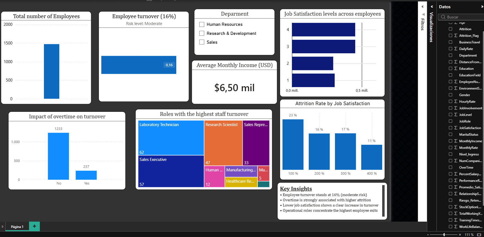

## HR Analytics – Employee Attrition Analysis

This project analyzes employee attrition using Power BI, focusing on:
- Turnover rate
- Overtime impact
- Job satisfaction
- High-risk roles

### Key insights
- Employee turnover stands at 16% (moderate risk)
- Overtime strongly correlates with higher attrition
- Job satisfaction is a stronger driver than salary alone

### Tools
- Power BI
- Data modeling

### SQL Analysis 
I used advanced SQL queries (Window functions, CASE statements, and Aggregations) to extract insights on attrition patterns and employee burnout risks. This ensures a scalable data approach beyond visual tools
